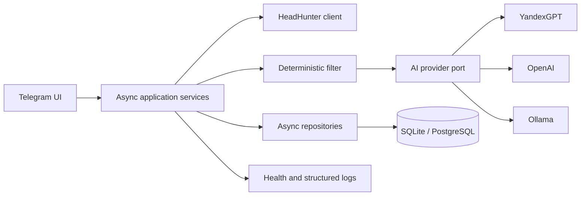
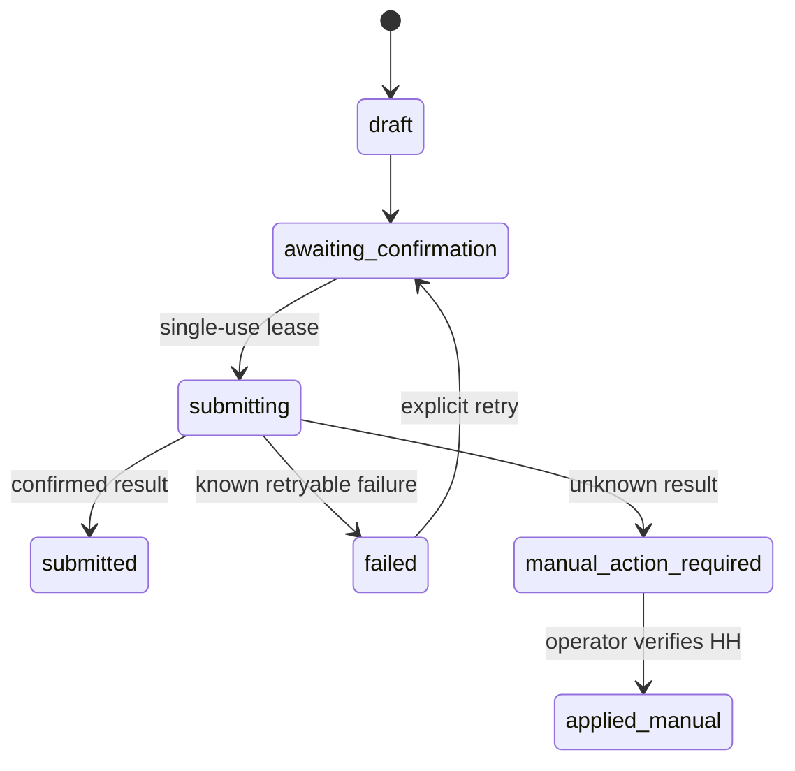

# AI Recruiter

[](https://github.com/Win4ez-ru/ai-recruiter/actions/workflows/ci.yml)

AI Recruiter is a single-user Telegram job-search agent that finds fresh vacancies
through the official HeadHunter API, removes duplicates, filters weak matches before
spending LLM tokens, produces an explainable shortlist, and tracks an application from
draft to offer.

It is deliberately built as a modular asynchronous monolith for one operator. The
project focuses on the engineering around real external systems: provider abstraction,
structured output, retries, idempotency, OAuth, transaction boundaries, observability,
and recoverable failure handling.

## Key features

- Configurable HeadHunter search with pagination, regional and remote filters, TTL
  refresh, and deduplication by source identity.
- A deterministic pre-filter followed by bounded LLM ranking through YandexGPT,
  OpenAI, or local Ollama.
- One Pydantic-validated result contract across all providers, with provider/model/
  prompt/input fingerprint traceability.
- Top results built only from current evaluations; stale scores stay auditable but do
  not leak into a new provider or prompt version.
- Personalized cover-letter drafts and HeadHunter OAuth 2 Authorization Code + PKCE.
- Durable application drafts, two-step confirmation, single-use tokens, submission
  leases, and no blind retry after an ambiguous external POST.
- A complete vacancy lifecycle with append-only transition history: saved, applied,
  interview, test task, offer, accepted, rejected, and archived.
- App-like Telegram navigation that edits one active message and restores screen state
  after a restart.
- SQLite for local use, PostgreSQL/asyncpg for deployment, Alembic migrations, JSON
  logs with credential redaction, health checks, and graceful shutdown.
- `DEMO_MODE` exercises the full flow while blocking the final HeadHunter submission.

## Architecture



The main boundaries are:

- transport handlers own Telegram and HTTP concerns;
- services own search, ranking, OAuth, UI state, and application workflows;
- repositories own transactions and persistence;
- provider adapters return the same validated analysis schema;
- the composition root wires concrete clients without leaking them into business
  logic.

One failed vacancy or provider call is isolated and logged. Safe, idempotent reads may
retry with backoff; potentially duplicating writes do not retry when the outcome is
unknown.

See [`docs/ARCHITECTURE.md`](docs/ARCHITECTURE.md) for the detailed data flow and
reliability contracts.

## How ranking works

1. `HHClient` combines configured searches and retrieves complete vacancy records.
2. `VacancySearchService` updates existing records and stores only new source IDs.
3. Rule-based filtering rejects obvious mismatches without an LLM call.
4. `VacancyRanker` sends a bounded candidate set to the selected provider.
5. JSON Schema and Pydantic validate score, reasoning, matches, gaps, and red flags.
6. The repository stores provider, model, prompt version, and an input hash.
7. Results are sorted only after all accepted analyses are persisted.

Changing the vacancy, candidate profile, résumé, provider, model, or prompt invalidates
the previous cache fingerprint and triggers a fresh evaluation.

## Application safety

The HeadHunter submission state machine separates drafting, confirmation, submission,
and local lifecycle finalization:



An unknown POST result is never automatically returned to `submitting`. The operator
must first check the official applications list, preventing duplicate applications.

## Tech stack

- Python 3.11–3.13 and asyncio
- aiogram, HTTPX, APScheduler
- Pydantic structured output
- SQLAlchemy 2 async, SQLite, PostgreSQL, Alembic
- YandexGPT, OpenAI Responses, Ollama
- Docker Compose, GitHub Actions, Ruff, pytest, coverage, pip-audit

## Getting started

```bash
git clone https://github.com/Win4ez-ru/ai-recruiter.git
cd ai-recruiter
python -m venv .venv
source .venv/bin/activate
python -m pip install -r requirements-dev.txt
cp .env.example .env
```

Configure a Telegram bot token, the permitted numeric Telegram user ID, and one AI
provider. For a local provider:

```env
AI_PROVIDER=ollama
OLLAMA_BASE_URL=http://127.0.0.1:11434
OLLAMA_MODEL=qwen3:4b-instruct
DEMO_MODE=true
```

Then initialize and run:

```bash
python -m alembic upgrade head
python run.py
```

For Docker:

```bash
docker compose up --build -d
docker compose logs -f job-agent
```

The complete environment reference is in `.env.example`; deployment and reverse-proxy
guidance is in [`docs/DEPLOYMENT.md`](docs/DEPLOYMENT.md).

## Testing

```bash
python -m ruff format --check app tests migrations scripts run.py
python -m ruff check app tests migrations scripts run.py
python -m pytest -q
python -m alembic check
```

CI runs the suite on Linux, macOS, and Windows with Python 3.11–3.13. It also enforces
coverage, audits dependencies, verifies SQLite and PostgreSQL migrations, and builds the
production Docker image.

Use [`docs/DEMO.md`](docs/DEMO.md) for a safe employer demo that uses a disposable
database and never sends a real application.

## Security and privacy

- `.env`, working databases, logs, the real candidate profile, and the real résumé are
  ignored. Only anonymized example files belong in Git.
- Access is restricted to one configured Telegram user ID.
- Credentials are redacted from structured logs and excluded from Docker images.
- Yandex requests disable provider-side data logging by default.
- HeadHunter OAuth state is single-use, time-bounded, and protected with PKCE.

OAuth tokens are not yet encrypted at the application layer. Production deployment
therefore requires protected storage and backups; a multi-tenant version would need
KMS-backed envelope encryption.

## Project status

The current version is a working, single-user portfolio product with a production-shaped
deployment path. Search, ranking, lifecycle tracking, OAuth, draft recovery, migrations,
CI, and demo mode are implemented.

The next meaningful steps are a versioned golden evaluation set, application-level OAuth
token encryption, profile-driven search configuration, and tenant-aware storage only if
the product expands beyond one operator.
