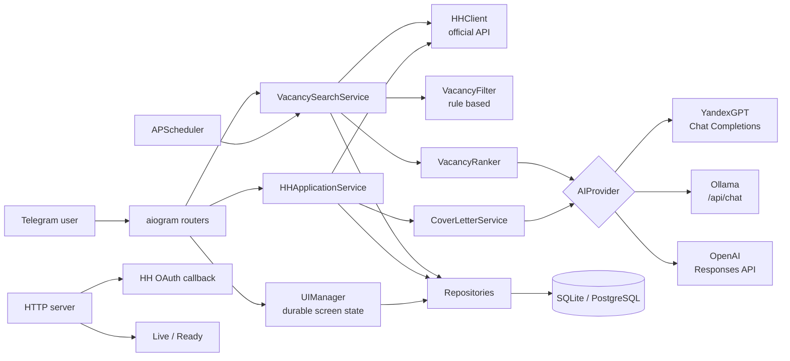
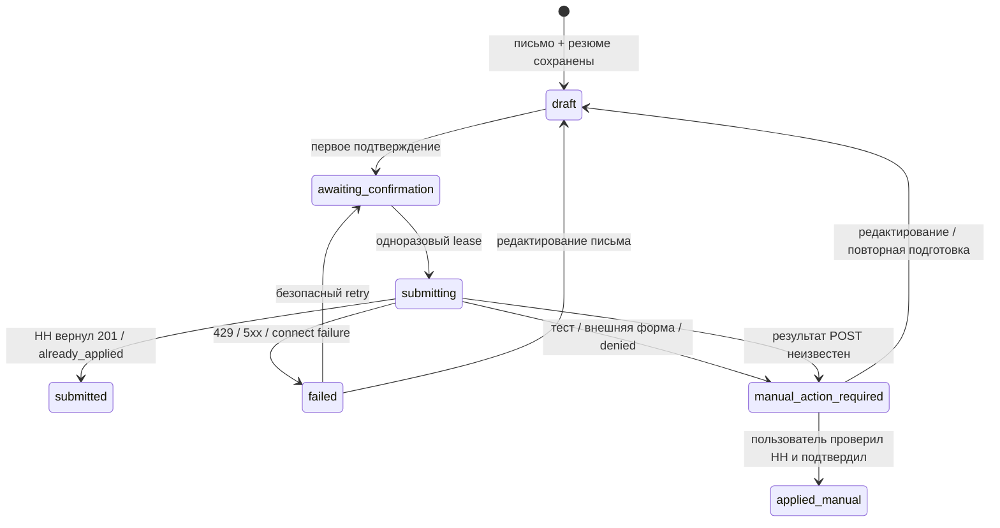
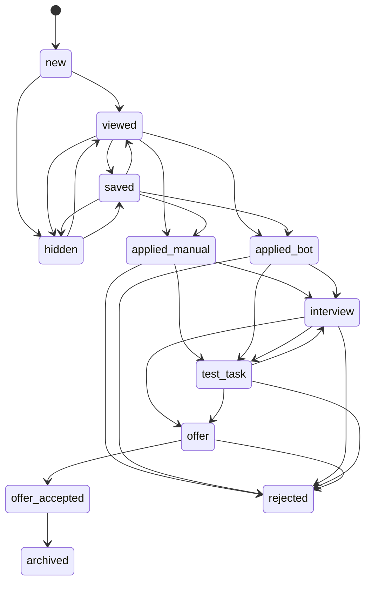

# Архитектура AI Recruiter

## Контекст и цель

AI Recruiter — однопользовательский асинхронный модульный монолит. Его главная ценность не в количестве интеграций, а в надёжном сквозном сценарии: найти вакансию, объяснить соответствие профилю, подготовить контролируемый отклик и вести результат по воронке найма.

Микросервисы, Redis и очередь намеренно не добавлены: для одного пользователя они увеличили бы эксплуатационную сложность без продуктовой пользы. Границы модулей оставляют возможность вынести workers и multi-tenant API позже.

## Компоненты

## Основной search flow

1. Семь запросов к HH объединяются по `external_id`.
2. Детали новых и устаревших вакансий обновляются с ограниченной конкурентностью.
3. Дешёвый фильтр исключает нерелевантные и заведомо блокирующие позиции.
4. AI получает только кандидатов после фильтра и возвращает строгую `VacancyAnalysisResult`.
5. YandexGPT/OpenAI обрабатывают ограниченное число вакансий параллельно; Ollama остаётся последовательной, чтобы не перегружать локальную память.
6. Pydantic повторно проверяет диапазоны, enum, массивы и запрет лишних полей. Malformed-ответ одной вакансии пропускается, provider-level сбой останавливает запуск новых задач.
7. В анализе сохраняются provider, model, prompt version и SHA-256 входных данных.
8. Изменение вакансии, профиля, резюме, модели или промпта делает оценку устаревшей и запускает переанализ.
9. Выдача фильтруется по текущим provider/model/prompt, сортируется по score и дате и ограничивается Top-5. Legacy-оценки остаются в БД, но не смешиваются с актуальными.
10. `MAX_AI_ANALYSES_PER_SEARCH` ограничивает стоимость одного запуска, а progress обновляется в одном Telegram-сообщении.

## AI-провайдеры

| Провайдер | Транспорт | Structured output | Типичный сценарий |
|---|---|---|---|
| YandexGPT | OpenAI-compatible Chat Completions | `json_schema` + Pydantic | Основной облачный режим с грантом |
| Ollama | Native `/api/chat` | JSON Schema + Pydantic | Бесплатная локальная разработка и fallback |
| OpenAI | Responses API | SDK parse + Pydantic | Опциональный облачный режим |

Бизнес-сервисы зависят только от протокола `AIProvider`. Названия провайдеров не попадают в пользовательские ошибки; конкретная модель видна только на dashboard и в технических метаданных.

Для Yandex по умолчанию отправляется `x-data-logging-enabled: false`, поскольку prompt содержит профиль и резюме. API-ключ и folder ID проходят только через environment/secret manager.

## Инварианты надёжности

- Один внешний HH-отклик имеет уникальную identity: пользователь + вакансия + резюме.
- Первое подтверждение создаёт хешированный одноразовый token; только второе получает submission lease.
- Черновик содержит письмо и выбранное резюме и не удаляется при внешней ошибке.
- `429`, `5xx` и connect failure переводят черновик в recoverable `failed`; повтор создаёт новый одноразовый token.
- Неоднозначный timeout внешнего POST не повторяется автоматически.
- Успешный HH-результат, lifecycle вакансии и запись истории фиксируются одной локальной транзакцией.
- При старте и периодически `submitted` без lifecycle автоматически восстанавливаются; старые `submitting` переводятся в `submission_result_unknown`, поэтому crash сразу после lease не оставляет запись зависшей навсегда.
- Только реально отрисованная карточка получает `is_sent=true`; загрузка подборки не уничтожает непросмотренные элементы.
- Долгая AI-операция имеет generation token и не может перерисовать экран после Back или нового действия.
- Активный экран, collection kind, позиция и pending OAuth intent переживают рестарт.
- Telegram failover повторяет только безопасные методы; потенциально дублирующие отправки вслепую не повторяются.

## State machine отправки в HH

`submission_result_unknown` принципиально не имеет автоматического перехода обратно в `submitting`: сначала пользователь проверяет официальный список откликов. Успех HH не считается подтверждённым до `201 Created` или однозначного `already_applied`.

## Lifecycle вакансии

Текущее состояние хранится в `applications`, а каждый переход — в append-only `vacancy_status_history`. `application_source` не теряется при переходе к интервью, отказу или архиву, поэтому воронка остаётся корректной.

## Данные и миграции

- SQLAlchemy 2 async repositories скрывают транзакции от transport/UI слоёв.
- SQLite — локальный single-process режим; PostgreSQL проверяется отдельным CI job.
- Alembic имеет одну линейную head revision и тестируется upgrade/check/downgrade на SQLite.
- Legacy-база без `alembic_version` принимается только после точного сравнения metadata командой `python -m scripts.adopt_legacy_database`; слепой `stamp` запрещён runbook.
- Реальные резюме и профиль не копируются в Docker image; контейнер получает их через read-only volume или secret files.

## Наблюдаемость и качество

- JSON logs редактируют credentials и структурированные sensitive fields.
- `/health/live` отражает жизнь event loop; `/health/ready` становится `200` только после БД и Telegram bootstrap.
- Search logs содержат отдельные `hh_duration_ms`, `ai_duration_ms`, число AI-запросов, cache hits и фактический concurrency; каждый ranking имеет собственную длительность.
- CI: Python 3.11–3.13, Linux/macOS/Windows, Ruff, format check, coverage gate 65%, pip-audit, SQLite/PostgreSQL migrations и Docker build.

## Осознанные ограничения

- Один `TELEGRAM_USER_ID`, одна polling-реплика и один профиль.
- OAuth-токены HH пока требуют защиты диска/БД и не имеют application-level KMS encryption.
- Rule-based policy и поисковые запросы пока ориентированы на iOS-профиль.
- Нет golden eval-набора для сравнения качества YandexGPT и Ollama на размеченных вакансиях.

Следующий разумный шаг — не микросервисы, а versioned eval dataset, шифрование OAuth-токенов, настройка search policy из профиля и tenant-aware schema при появлении реальных пользователей.
